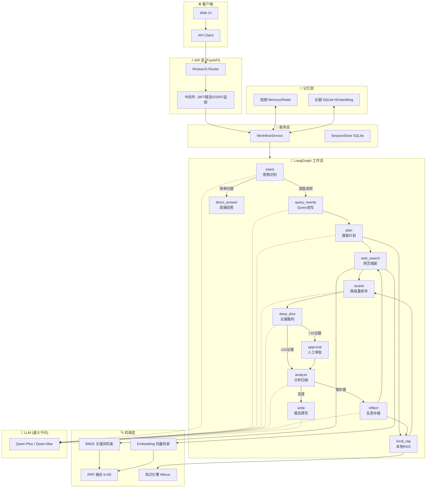

# Deep Research Agent — 系统架构图

```mermaid
graph TB
    subgraph 客户端["🌐 客户端"]
        WEB[Web UI]
        API[API Client]
    end

    subgraph API层["⚡ API 层 (FastAPI)"]
        ROUTER[Research Router]
        MIDDLEWARE[中间件: JWT/限流/SSRF/追踪]
    end

    subgraph 服务层["🔧 服务层"]
        WS[WorkflowService]
        SS[SessionStore SQLite]
    end

    subgraph LangGraph["🧠 LangGraph 工作流"]
        INTENT[intent\n意图识别]
        QR[query_rewrite\nQuery改写]
        PLAN[plan\n搜索计划]
        WS2[web_search\n网页搜索]
        LR[local_rag\n本地RAG]
        RR[rerank\n两级重排序]
        DD[deep_dive\n证据裁判]
        AN[analyze\n分析归纳]
        REF[reflect\n反思补搜]
        WR[write\n报告撰写]
        DA[direct_answer\n直接回答]
        AP[approval\n人工审批]
    end

    subgraph 检索层["🔍 检索层"]
        BM25[BM25 关键词检索]
        EMB[Embedding 向量检索]
        RRF[RRF 融合 k=60]
        KE[知识引擎 Milvus]
    end

    subgraph LLM["🤖 LLM (通义千问)"]
        QWEN[Qwen-Plus / Qwen-Max]
    end

    subgraph 记忆层["💾 记忆层"]
        SM[短期 Memory/Redis]
        LM[长期 SQLite+Embedding]
    end

    WEB --> API
    API --> ROUTER
    ROUTER --> MIDDLEWARE
    MIDDLEWARE --> WS
    WS --> LangGraph

    INTENT --> |"简单问题"| DA
    INTENT --> |"深度调研"| QR
    QR --> PLAN
    PLAN --> WS2
    PLAN --> LR
    WS2 --> RR
    LR --> RR
    RR --> DD
    DD --> |">10证据"| AP
    DD --> |"≤10证据"| AN
    AP --> AN
    AN --> |"需补搜"| REF
    AN --> |"完成"| WR
    REF --> WS2
    REF --> LR

    WS2 --> BM25
    WS2 --> EMB
    BM25 --> RRF
    EMB --> RRF
    LR --> KE

    INTENT -.-> QWEN
    QR -.-> QWEN
    PLAN -.-> QWEN
    RR -.-> QWEN
    DD -.-> QWEN
    AN -.-> QWEN
    REF -.-> QWEN
    WR -.-> QWEN

    SM <--> WS
    LM <--> WS
```
